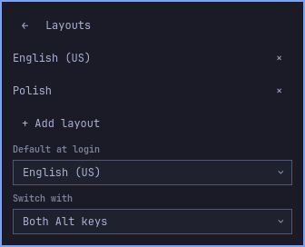

# Keyboard Settings for Omarchy

Native keyboard layout and variant picker for Omarchy's Quickshell bar. It
replaces the stock `omarchy.keyboard-layout` entry in the same slot. This is an
independent plugin and is not an official Omarchy project.



The planned first release is a **public beta**. The current `0.1.0` source is a
pre-release candidate: automated and isolated checks pass on the recorded Omarchy
environment, while final physical typing, login and clean-system acceptance remain
listed in [VALIDATION.md](VALIDATION.md).

## What it does

- Click the language label to switch an already loaded layout.
- Open **Edit layouts…** to add or remove installed XKB layouts and variants,
  choose the default at login, and select the switching shortcut.
- Save up to four layouts. The first saved layout is the login default.
- Preserve unrelated XKB options such as Compose and Caps Lock behavior.
- Refuse ambiguous keyboards, custom keymaps and unsafe shortcut maps instead of
  guessing.

Saved edits take effect after the next graceful sign-out or reboot. The editor
never replaces the live keymap. Switching from the picker uses only Hyprland's
existing loaded layouts and does not reorder the saved login default.

The indicator rolls through a country flag when switching. Set `"animate": false`
on its bar entry to disable that feedback; reduced compositor motion is respected.
Keyboard navigation and Escape dismissal work throughout the popup.

The plugin does not configure the console, disk unlock, locale, mouse, keybindings
or IME engines. Test actual letters and shortcut directions after login: compiled
keymaps and fixture screenshots cannot prove physical typing.

## Requirements

The verified environment is Omarchy 4.0.2, Hyprland 0.56.2, Quickshell 0.3.1,
Qt 6.11.2, libxkbcommon 1.13.2 and xkeyboard-config 2.48. These are tested
versions, not minimum-version claims. The runtime uses only Omarchy components,
Python's standard library and installed system keyboard data. There are no pip
packages, downloads or web services at runtime.

Your Hyprland Lua configuration must load `default.hypr.toggles`. Activation
installs one fixed, plugin-owned Lua loader. Saves update only inert pending data;
the loader promotes it as Hyprland shuts down and the next session reads it. The
plugin never rewrites your `input.lua`.

## Install from Git

Omarchy must own the Git checkout so that its updater works. Add the repository
without `--enable`, then use the plugin's reversible activation helper. Every
helper command is a dry run unless `--apply` is present.

```sh
omarchy plugin add https://github.com/madmatt/omarchy-keyboard-settings.git
python3 ~/.config/omarchy/plugins/madmatt.keyboard-settings/tools/plugin.py activate
python3 ~/.config/omarchy/plugins/madmatt.keyboard-settings/tools/plugin.py activate --apply
```

Activation replaces exactly one stock keyboard indicator in place, preserving
its entry settings and center anchoring. It installs the fixed deferred-login
loader and stores the original entry and a bar backup under
`$XDG_STATE_HOME/omarchy/keyboard-settings/`, outside the Git checkout. Installing
the loader may make Hyprland re-read its configuration, but the loader uses the
current active data and does not change the current keyboard settings.

Do not use `omarchy plugin add ... --enable`: generic enable adds a second widget
and cannot preserve the stock entry's settings.

## Update

```sh
omarchy plugin update madmatt.keyboard-settings
```

Receipts and saved keyboard settings live outside the checkout, so a normal
fast-forward update keeps them. Review the updater's diff before accepting it.
Omarchy updates from the repository's default branch; release archives and tags
do not pin this command.

## Remove

Prepare removal first, review the dry run, apply it, and then let Omarchy delete
the checkout:

```sh
python3 ~/.config/omarchy/plugins/madmatt.keyboard-settings/tools/plugin.py prepare-remove
python3 ~/.config/omarchy/plugins/madmatt.keyboard-settings/tools/plugin.py prepare-remove --apply
omarchy plugin remove madmatt.keyboard-settings
```

By default, preparation restores the stock indicator and backs up and removes
the plugin-owned loader plus its active and pending data, returning ownership to
your existing Lua configuration. To keep the saved login keyboard configuration
active after removing the UI, use:

```sh
python3 ~/.config/omarchy/plugins/madmatt.keyboard-settings/tools/plugin.py prepare-remove --keep-settings --apply
omarchy plugin remove madmatt.keyboard-settings
```

If generic disable removed the bar entry first, `prepare-remove` can reconstruct
the stock entry from its receipt. If the checkout was already deleted, add the
same repository again, run `prepare-remove --apply` without activating it, and
then remove it normally.

## Migrate a copied development installation

Run the new lifecycle helper from this source checkout. It validates the old
copy against its receipt before changing anything:

```sh
python3 tools/plugin.py prepare-remove --keep-settings
python3 tools/plugin.py prepare-remove --keep-settings --apply
omarchy plugin remove madmatt.keyboard-settings
omarchy plugin add https://github.com/madmatt/omarchy-keyboard-settings.git
python3 ~/.config/omarchy/plugins/madmatt.keyboard-settings/tools/plugin.py activate --apply
```

Omit `--keep-settings` if you want to reset the loader and saved data during
migration. A modified old installation is deliberately refused for manual review.

## Troubleshooting and privacy

See [SUPPORT.md](SUPPORT.md) for safe diagnostics and recovery. The plugin never
captures or stores typed text. Its state can contain configured layout IDs and
local keyboard interface names, so do not post raw state or helper `status`
output. Use `python3 tools/diagnostics.py` for a redacted report.

Plugins run with your user permissions and are not sandboxed. Review the source
and the update diff. Security reports should use the private channel in
[SECURITY.md](SECURITY.md).

## Development and release checks

Run from the repository root on a compatible Omarchy installation. The native
harness uses installed `qs.Ui` and `qs.Commons` components with an offscreen
fixture; it does not connect to the live Wayland keyboard session.

```sh
mkdir -p work
python3 -B -m unittest discover -s tests -v
python3 -B tests/benchmark_health.py
python3 tests/render_native.py
python3 -B tools/package.py
```

Outputs are written under ignored `work/`. Packaging starts with an empty stage,
derives the version and entry point from `manifest.json`, validates it with
Omarchy, and produces a byte-reproducible supplemental archive plus checksum.
Git installation is the supported user route; the archive does not contain the
activation helper.

Implementation contracts are in [docs/keyboard-settings.md](docs/keyboard-settings.md),
the publication runbook is in [docs/publishing.md](docs/publishing.md), and exact
evidence and open live checks are in [VALIDATION.md](VALIDATION.md).
